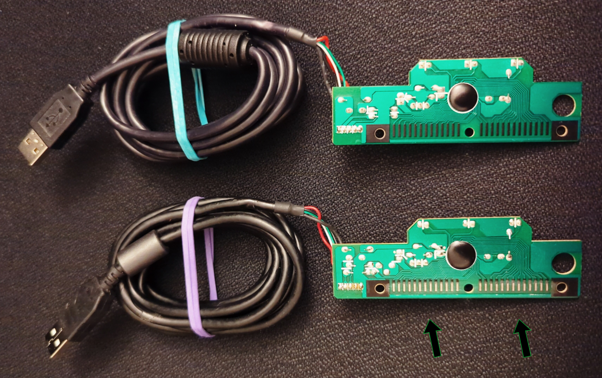
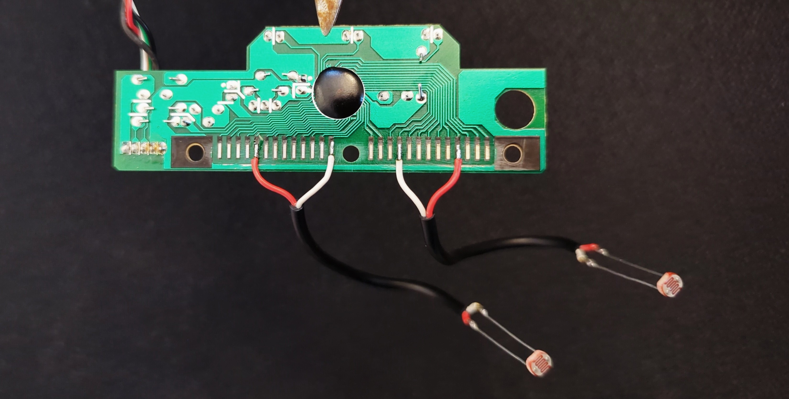
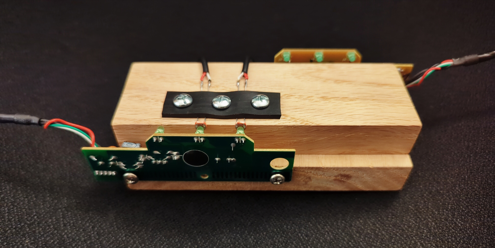
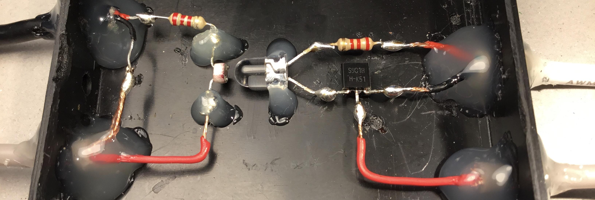

### Run it

```apt install g++ geany libx11-dev```. Open the .cpp in Geany.<br>
Go to Build >> Set Build Commands. Where it says "Compile" and "Build", append " -lX11".<br>
Hit F9 once. F5 to run.

<br>

### Terminal

```text
(1) Send files
(2) Receive files

Option: |
```

<br>

<p align="center">
  <video src="https://github.com/user-attachments/assets/d0d9cbb4-6c59-40aa-bb96-007b52a0e3cb" controls="controls" muted="muted" style="max-width: 100%;">
  </video>
</p>

<br>

### :hocho: Gut 2 keyboards & sand off black coating on one (I'm using DELL SK-8115)

<p align="center">
  
</p>

<br>

### Sanded keyboard: solder photoresistors to pins that type something when shorted

<p align="center">
  
</p>

<br>

### Make the photoresistors face the other keyboard's LEDs for num lock & caps lock

<p align="center">
  
</p>

<br>

### Receive files without installing or appending anything (option 2 by itself):

https://github.com/compromise-evident/unidirectional-network/blob/main/docs/zero_dependency_receive_files.cpp

<br>

### FTP logic

* Just before each file is sent, num lock blinks 1 time so the receiver knows
  which character is bit 0. It's ok if your computer swapped num lock & caps
  lock.
* Just before each byte is sent, the character representing bit 0 blinks 1 time
  so the receiver knows that this is not the last byte. If a byte is instead
  preceded by the character representing bit 1, that's the last byte of the
  file.

<br>

### FTP is safe

Because of the logic above, if you had momentarily opened the box and allowed
light to corrupt the transfer, everything's fine. The receiver will always
readjust and continue receiving remaining bytes correctly.

<br>

------------------------------------------------------------------------------------------------------------------------------------------------------

### Or 345B/s (press enter & play wav at the same time)

This method proves that modern generic photoresistors are
sensitive to at least 5,520 adjustments in brightness per second
(an opposite bit is appended to each data bit to keep
the LED brightness normalized.) The bottleneck is the LED;
it cannot become darker fast enough after each flash of light.

LEFT: power to the microphone line, interrupted by photoresistor.<br>
RIGHT: power to the LED, interrupted by audio silence.

<p align="center">
  
</p>

<p align="center">
  
</p>

<p align="center">
  <video src="https://github.com/compromise-evident/unidirectional-network/assets/75550631/4a9a4f20-4205-4f49-96c6-10445f4c7c2d" controls="controls" muted="muted" style="max-width: 100%;">
  </video>
</p>

<p align="center">
  
</p>

See [LED.cpp](https://github.com/compromise-evident/unidirectional-network/blob/main/docs/LED/LED.cpp). (May need to tilt photoresistor away as in video above. Use it in a dark enclosure). <br>
<sub>*Receiving machine must have audio recording hardware at least like that of the Dell Latitude E5500 (made in 2008).<br>
If you own a modern thousand-dollar laptop, this won't work; your mic line is always noisy, even when disabled.<sub/>

<br>

### Send files to the sending machine via truly instant NAS (no systemd)

https://github.com/compromise-evident/what-not/blob/main/truly_instant_NAS

<br>

### Send files to the sending machine via local network.

* Sending machine should have the Gnome desktop environment, unfortunately.
  Go to Settings, Sharing. Enable sharing, then enable
  "File Sharing" without password. This creates a "Public"
  folder in /home/user/ if missing.
* Sending machine should run these tools in a new folder in /home/user/Public.
* Now any machine on that network has read / write access
  to that "Public" folder. Find it in your files browser
  in "Browse Network" or "Other Locations" and keep dropping files in folder "Send".

<br>

### DIY

https://github.com/compromise-evident/what-not/blob/main/process_file_by_bits.cpp

https://github.com/compromise-evident/what-not/blob/main/presses_enter_after_you_type_n_characters.cpp

https://github.com/compromise-evident/what-not/blob/main/toggle_num_lock_and_caps_lock.cpp

https://github.com/compromise-evident/what-not/blob/main/date.cpp

<br>

### Appendix

unidirectional-network has been written about on
[HACKADAY](https://hackaday.com/2024/03/19/photoresistors-provide-air-gap-data-transfer-slowly/).
